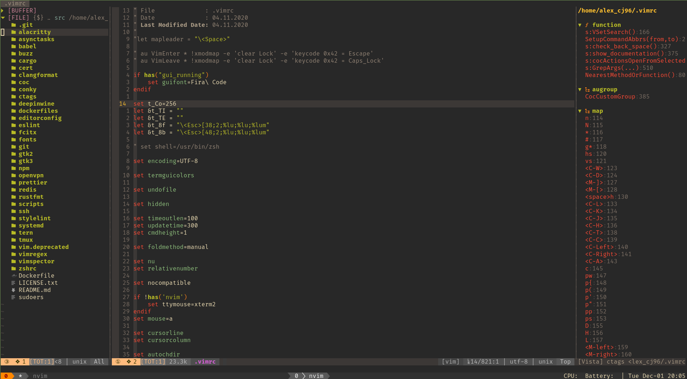
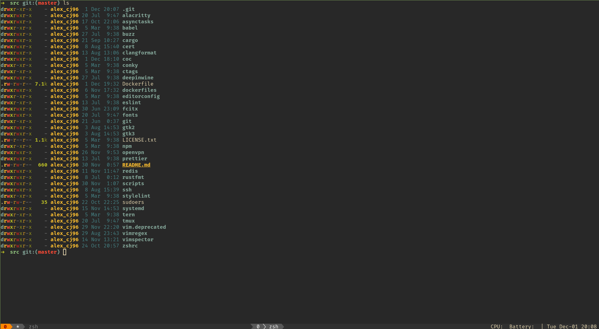

# vim-docker-env

vim docker development environment

## Features

-   vim & neovim
-   coc.nvim
-   a bunch of awesome coc extensions
-   alacritty
-   tmux
-   fira code fonts
-   rust, go, js/ts, c/c++, java, python
-   autojump
-   zsh
-   ripgrep, bat, fd, exa...
-   vimspector debug
-   ranger

## Usage

1. enter docker for working

```
alias vimdocker='docker run -v /var/run/docker.sock:/var/run/docker.sock --rm -it alexcj96/vim-docker-env:latest zsh'
alias vimdockerd='docker run -v /var/run/docker.sock:/var/run/docker.sock --rm -p 9999:9999 alexcj96/vim-docker-env:latest'
```

2. launch
```
vimdocker
```

3. launch as ssh daemon

```
vimdockerd
# Connect: ssh -A alex_cj96@localhost -p 9999
# Default password: alex_cj96
```

**Note**: this container may contains my personal information, you can edit the container and build your own image!

## Screenshots




## Todo

-   add common cxx dependencies like boost, dlib, paho, geographiclib...
-   passing `GITHUB_TOKEN`, `GITLAB_TOKEN` to container so that command like `:GBrowse` makes sense
-   minimize
-   remove personal information
